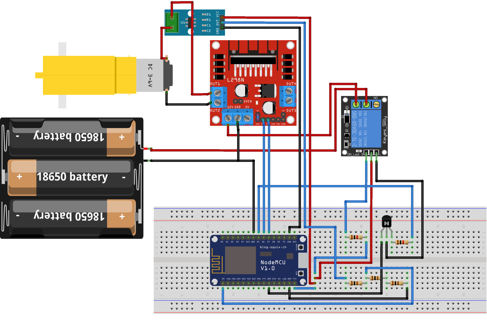

# Smart Motor Overload Protection System

A circuit design for a NodeMCU DC motor protection system using current sensing and relay power isolation.

## Components

- NodeMCU
- ACS712 current sensor
- L298N motor driver
- Relay module
- NPN transistor and resistors
- DC motor
- Three-cell 18650 battery holder
